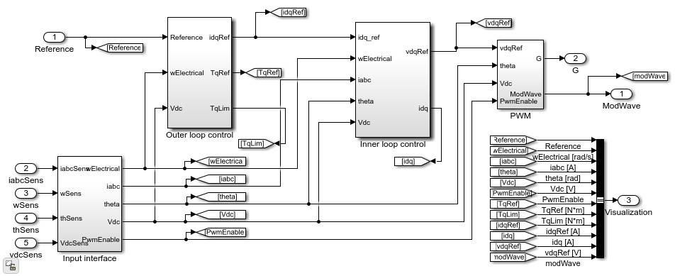
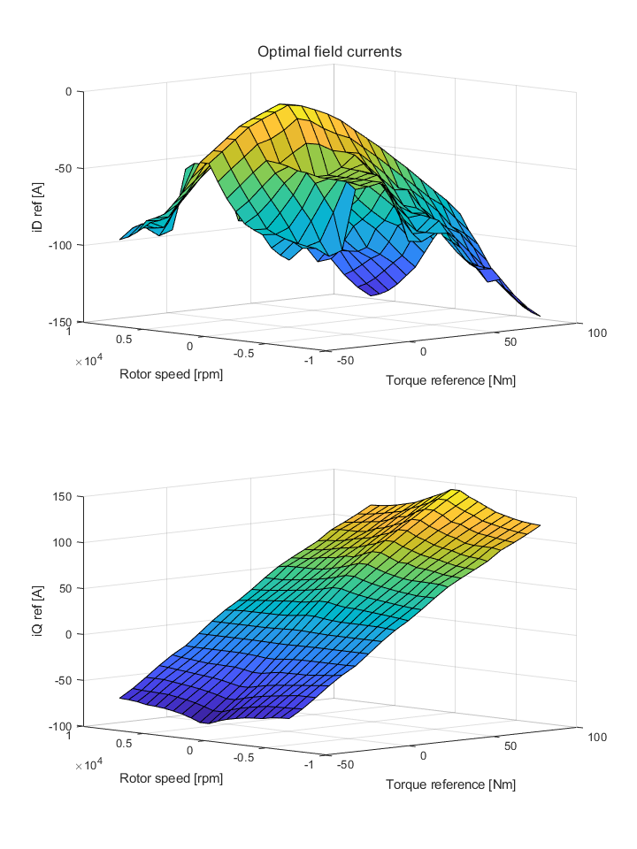
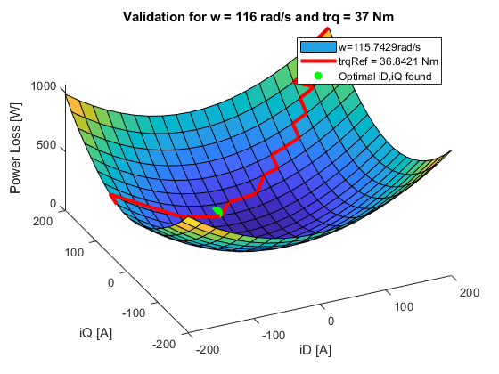
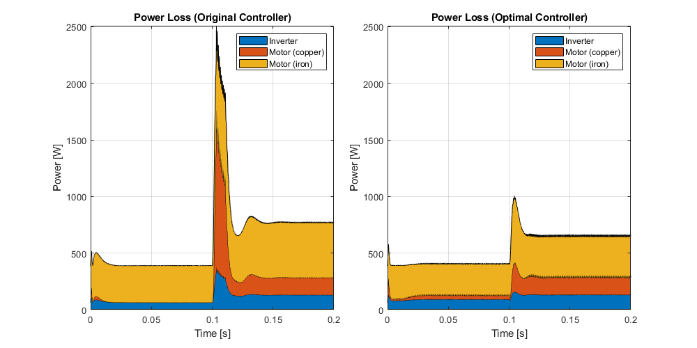

# **Motor Efficiency Improvements With Optimized Control Parameters**

 

## Overview
PMSM drive using imported FEM data and optimized Field-Oriented Control (FOC), with supporting design scripts that:
1.	Determine open-loop frequency response and check stability margins. This requires Simulink® Control Design™, using the Frequency Response Estimator block.
2.	Determine the optimal d-axis and q-axis currents that minimize overall motor losses when delivering a commanded torque and speed.

The Electric Drive is implemented using:
1.	A detailed Simscape™ Electrical™ nonlinear motor model in the form of tabulated flux linkages and Steinmetz coefficients. For more information, see [this example](https://www.mathworks.com/help/physmod/sps/ug/import-ipmsm-flux-linkage-data-from-motor-cad.html). 
2.	A Field-Oriented Controller (FOC) that has been optimized to minimize motor losses.

### **Drive System**
The drive is parameterized for a 70 kW (maximum power), 150 Nm (maximum torque) motor, suitable for an electric vehicle powertrain. The supply is a 500 V DC source.

### **Field-Oriented Controller Architecture**
The PMSM Field-Oriented Controller subsystem has an outer loop of speed control, and an inner loop of current control. The outer loop determines the current references for the inner loop.

### **Motor Loss Map**
The motor losses depend on d-axis and q-axis currents, and rotor speed. Motor losses are a combination of copper losses and iron losses.

### **Optimal Field Currents**
The *ControllerOptimization.mlx* Live Script computes the optimal d-axis and q-axis current references that minimize motor losses, in function of rotor speed and reference torque.

### **Optimization Validation**

### **Power Losses for Step Load**
The test scenario is a reference speed of 3000 rpm and a torque load stepped from 0 Nm to 50 Nm at t=0.1s.

You can notice the lower motor losses when using optimized control parameters.

## Setup 
Open the project file *PmsmDriveOptimization.prj* to get started.
- Run *workflows/ControllerOptimization.mlx* to compute the optimal control parameters.
- Run *workflows/FreqResponseAnalysis.mlx* to check the control system stability margins. This is computationally intensive.

### MathWorks Products (https://www.mathworks.com)
Requires MATLAB® release R2021b or newer.
- [Simscape](https://www.mathworks.com/products/simscape.html)
- [Simscape Electrical](https://www.mathworks.com/products/simscape-electrical.html)
- [Simulink](https://www.mathworks.com/products/simulink.html)
- [Simulink Control Design](https://www.mathworks.com/products/simcontrol.html)
- [Control System Toolbox](https://www.mathworks.com/products/control.html)
- [Optimization Toolbox](https://www.mathworks.com/products/optimization.html)

### Getting Started 
To learn more about modeling and simulation with Simscape™, please visit:
* [Simscape Getting Started Resources](https://www.mathworks.com/solutions/physical-modeling/resources.html)

## License
The license is available in the License file within this repository.

## Community Support
[MATLAB Central](https://www.mathworks.com/matlabcentral)

Copyright 2022 The MathWorks, Inc.
